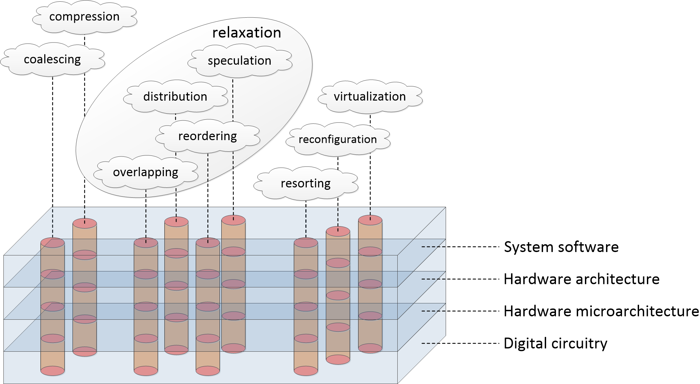

# Catalogue of Performance Optimization Mechanisms

### Description

This repo is a systematized live catalogue of performance optimization mechanisms implemented on various levels of computer architecture.

Systematization is based on observation that it is possible to formulate generic optimization approaches that are agnostic to:
* HW/SW implementation (hardware- or software-only, mixed manner),
* nature of management engine (processor microarchitecture, OS kernel, software compiler, hardware synthesizer/generator, etc.),
* type of computational traffic elements (processing, communicational, memory operations),
* data being processed (data bytes, network packets, graphic assets, etc.),
* stage of the system life cycle (both statically and dynamically),
* degree of automation (manually, fully automatically, and everything in between).

These approaches designate useful "computational effects" addressed by various optimization mechanisms. Also, they provide potential directions for generation of new mechanisms that improve density, regularity of computations, facilitate their scalability, decongestion, and intensification. Knowledge of these generic approaches can assist in both making computational artifacts "implementation-friendly" in general and adapting them to specific physical and/or platform capabilities and constraints. (Micro)Architectures are understood mostly as practical compositions of these mechanisms.

These approaches have been formulated as **Strategies of Computational Process Synthesis (SCPS)**. Preliminary version of the catalogue was published in previous works [1, 2].

SCPS formulations:

* **relaxation** – reduction of coupling/interlocks between requests. Contains four subcategories:
	* **overlapping** – decoupling of initiation of new request processing with completion of previous requests;
	* **distribution** – partitioning of workload in loosely dependent parts;
	* **reordering** – relaxation of ordering constraints, forwarded/deferred execution;
	* **speculation** – performing (possibly redundant) computations in advance in the interest of latency reduction;

* **compression** – reduction of workload processing cost. Contains two subcategories:
	* **coalescing** – increasing granularity of workload elements to decrease management overhead;
	* **elimination** – detection and removal of redundant computations;

* **variation** – handling variability of workload elements. Contains three subcategories:
	* **resorting** – re-grouping workload elements in generic or dedicated categories based on various properties (spatial, parametric, functional) that affect their execution;
	* **reconfiguration** – introduction of changeability of system parameters and internal mechanisms, allocation of common “hard” substrate for diverse “soft” workload elements;
	* **virtualization** – allocation of new management overlays that selectively abstract chosen mechanisms for their interoperable application in various scenarios.

Examples of performance optimization mechanisms grouped in SCPS categories:

Classic computer architecture levels | Relaxation (overlapping)
---------------------------- | ------------------------
Generic | Asynchronous processing, shadow/ping-pong/double buffering, data/task queuing
Web | Asynchronous web services, event loop (non-blocking I/O)
Graphics | Pipelined rendering
DBMS | Concurrency control protocols, data streams processing
System software (OS, VMs, drivers) | OS pipes, OS multitasking, spooling, asynchronous I/O
System software (compilers and runtimes) | Software pipelining, software register renaming, lock-free data structures and programming, asynchronous programming environments
Processor architecture | Software data hazard resolution, stall reduction, rotating register files, delay slots, lock-free synchronization instructions
Hardware microarchitecture (processing) | Pipelined processing of instructions
Hardware microarchitecture (communication) | Packet switching, split transaction protocols, sliding window flow control, pipelined packet routing, wormhole switching/routing
Hardware microarchitecture (memory) | Memory pipelining, hardware register renaming, non-blocking caches
Digital circuitry | Synchronous pipelines, wave pipelines

Classic computer architecture levels | Relaxation (distribution)
---------------------------- | -------------------------
Generic | Data partitioning, subtasks allocation
Web | Parallel HTTP requests, HTTP chunking, code splitting, segmented file transfer, multi-server setups, MapReduce model, content delivery networks
Graphics | Space partitioning, mesh decomposition
DBMS | Database partitioning, replication/sharding
System software (OS, VMs, drivers) | OS multithreading
System software (compilers and runtimes) | Parallel programming environments, work sharing/stealing, coroutines, static parallelization, loop fission
Processor architecture | Decoupled access/execute, multi/many-core architectures, simultaneous multithreading, asynchronous offload engines, multi-channel DMA
Hardware microarchitecture (processing) | Superscalar processing of instructions
Hardware microarchitecture (communication) | Parallel links, concurrent slaves arbitration, dense topologies, distributed NoC routing
Hardware microarchitecture (memory) | Multiporting, multibank partitioning, multi-way set-associative caches, coherent caches
Digital circuitry | Application mapping on multiple hardware resources in HLS, logic replication

Classic computer architecture levels | Relaxation (reordering)
---------------------------- | -----------------------
Generic | Lazy object initialization
Web | Lazy connections/loading
Graphics | Mesh vertices reordering, out-of-order rasterization, forwarded/deferred rendering
DBMS | Prioritized resource scheduling, query reordering
System software (OS, VMs, drivers) | Thread priority scheduling, I/O requests sorting
System software (compilers and runtimes) | Lazy evaluation, code motion, frequent branch prioritization, loop blocking (tiling), loop interchange
Processor architecture | Dataflow architectures, relaxed memory models
Hardware microarchitecture (processing) | Out-of-order execution of instructions, scoreboarding/Tomasulo scheduling algorithm
Hardware microarchitecture (communication) | Out-of-order completion of transfers
Hardware microarchitecture (memory) | Deferred store buffers
Digital circuitry | Operations reordering in HLS, retiming in logic synthesis

Classic computer architecture levels | Relaxation (speculation)
---------------------------- | ------------------------
Generic | Data caching and prediction, speculative resource allocation
Web | Link prefetching, preloading, prebrowsing, web/network caching
Graphics | Texture caching
DBMS | Speculative query execution
System software (OS, VMs, drivers) | Storage data prefetching
System software (compilers and runtimes) | Thread-level speculation, software transactional memory, speculative predicates
Processor architecture | Hardware transactional memory
Hardware microarchitecture (processing) | Computational caches, branch prediction/predication, return address stack, memory requests prediction, register/memory value prediction
Hardware microarchitecture (communication) | Speculative propagation and stomping
Hardware microarchitecture (memory) | Prefetching to data caches and stream buffers, locality in caching policies
Digital circuitry | Multiplexing multiple pre-computed results

Classic computer architecture levels | Compression (coalescing)
---------------------------- | ------------------------
Generic | Data/task bundling, data buffering
Web | Web resource bundling, HTTP requests merging, media content buffering
Graphics | GPU thread coarsening, sparse textures
DBMS | Data clustering
System software (OS, VMs, drivers) | Increased OS scheduling time quantum, I/O requests coalescing, batch processing, slab allocation, scatter/gather I/O, file defragmentation, file archiving, VM proximity placement groups
System software (compilers and runtimes) | Instruction combining, loop unrolling, loop fusion, heap defragmentation
Processor architecture | CPU clustering, SIMD, VLIW architectures, FMA instructions, interrupt coalescing
Hardware microarchitecture (processing) | Instruction fusion
Hardware microarchitecture (communication) | Enlarged packets (e.g. jumbo frames), burst transfers
Hardware microarchitecture (memory) | Memory accesses coalescing, write combining
Digital circuitry | Wide functional units, operation clustering (chaining) in HLS, high number input LUT in FPGAs

Classic computer architecture levels | Compression (elimination)
---------------------------- | -------------------------
Generic | Data compression, data indexing, data deduplication, object pooling, source code minification
Web | HTTP compression, web media compression, tree shaking, partial page update
Graphics | View frustum culling, levels of detail, polygon clipping, occlusion culling, texture compression, tiled rendering
DBMS | Denormalization, recycling of intermediate results
System software (OS, VMs, drivers) | Context switch minimization, zero-copy data transfers, memory balooning, memory overlays, page combining, file compression
System software (compilers and runtimes) | Constant folding/propagation, floating- to fixed-point conversion, register recycling/reuse, register promotion, structure packing, dead code elimination, common subexpression elimination, strength reduction, branch tables, branch elimination, loop splitting, computation reuse, memoization, precompiled headers, deforestation, garbage collection, neural network pruning/quantization
Processor architecture | Compressed (with increased code density) ISA
Hardware microarchitecture (processing) | Loop stream detection, dynamic instruction reuse, interrupt tail-chaining
Hardware microarchitecture (communication) | Sparse NoC topologies, NoC traffic compression
Hardware microarchitecture (memory) | Hardware data compression, reducing processor-memory traffic using caches, caching exclusivity, write-back caching policy
Digital circuitry | Bitwidth narrowing, register merging, logic minimization, dead/duplicated logic removal, redundant reset elimination, power/clock gating

Classic computer architecture levels | Variation (resorting)
---------------------------- | ---------------------------
Generic | Allocation/mapping on traffic types, diverse algorithms and data structures
Web | Internet media types
Graphics | Shader types, variable rate shading
DBMS | Query prioritization
System software (OS, VMs, drivers) | Priority classes, QoS scheduling, asymmetric multiprocessing environments
System software (compilers and runtimes) | Instruction replacement, (un)likely attributes, task partitioning for heterogeneous platforms
Processor architecture | ISA extensions, cache partitioning, interrupt priority levels, general-purpose/domain specific processors, asymmetric multiprocessors
Hardware microarchitecture (processing) | Allocation/mapping on diverse pipeline stages, execution units, and microarchitectural templates
Hardware microarchitecture (communication) | Topology variability, heterogeneous networks, QoS traffic classes
Hardware microarchitecture (memory) | Memory hierarchy, NUMA
Digital circuitry | High performance and low power process technologies, variably optimized (e.g. for speed/leakage) standard cells, clock/data networks, generic LUTs and hard macro blocks in FPGA, voltage-frequency island partitioning

Classic computer architecture levels | Variation (reconfiguration)
---------------------------- | ---------------------------
Generic | Platform programmability/reconfigurability
Web | Microservices continuous delivery
Graphics | Shader programmability
DBMS | Performance tuning options
System software (OS, VMs, drivers) | Microkernel architecture, process priorities reconfiguration
System software (compilers and runtimes) | Neural network learning, compiler optimization flags
Processor architecture | Processors’ programmability, switchable ISAs, modes of execution, customizable memory models
Hardware microarchitecture (processing) | Microprogrammable processors, CGRAs, conservation cores, branch predictor adaptation
Hardware microarchitecture (communication) | Reconfigurable QoS, reconfigurable NoC topologies, software-defined networking
Hardware microarchitecture (memory) | Cache mapping adaptation
Digital circuitry | FPGA LUT programmability, DVFS, reconfigurable macro blocks, back-annotated synthesis, synthesis/implementation constraints

Classic computer architecture levels | Variation (virtualization)
---------------------------- | --------------------------
Generic | Multi-layer system architecture
Web | OSI multi-layer model, language embedding in HTML, WebAssembly, cloud services
Graphics | Standardized graphics APIs, unified shader model
DBMS | Database virtualization, common query languages
System software (OS, VMs, drivers) | OS containers, platform emulation
System software (compilers and runtimes) | Managed programming environments, multi-stage compilation
Processor architecture | CPU ISA/microarchitecture separation, hardware CPU virtualization, FPGA temporal partitioning, virtual forwarding/routing, virtual memory
Hardware microarchitecture (processing) | Dynamic binary translation, composed multicores, dynamic synthesis of thread accelerators ("thread warping")
Hardware microarchitecture (communication) | Virtual channels, multi-layer protocols, link auto-training, cognitive radio
Hardware microarchitecture (memory) | Hardware cache hierarchy management
Digital circuitry | Logic simulation, programmable logic

### Publications

* A. Antonov, “Methods and Tools for Computer-Aided Synthesis of Processors Based on Microarchitectural Programmable Hardware Generators,” Ph.D dissertation, ITMO University, Saint-Petersburg, 28.12.2018. URL: http://fppo.ifmo.ru/dissertation/?number=63419

* A. Antonov, P. Kustarev, “Strategies of Computational Process Synthesis – a System-Level Model of HW/SW (Micro)Architectural Mechanisms,” in 2020 9th Mediterranean Conference on Embedded Computing (MECO), 2020. URL: https://ieeexplore.ieee.org/document/9134071
