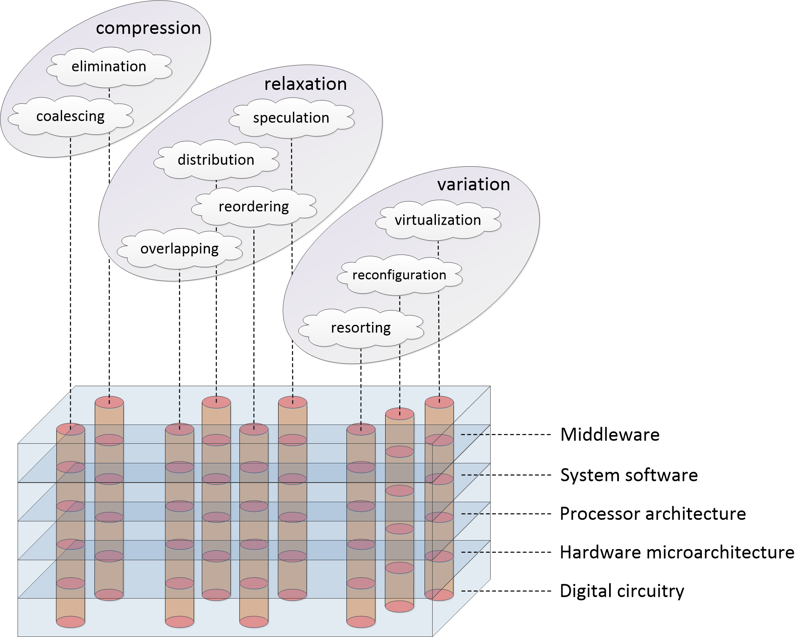

# Catalogue of performance optimization mechanisms

### Description

This repo is a systematized catalogue of performance optimization mechanisms implemented on various levels of computer architecture.

Systematization is based on observation that it is possible to formulate generic optimization approaches that are agnostic to:
* HW/SW implementation (hardware- or software-only, mixed manner),
* nature of management engine (processor microarchitecture, OS kernel, software compiler, hardware synthesizer/generator, etc.),
* type of computational process elements (computational, communication, memory operations),
* data being processed (data bytes, network packets, graphic assets, etc.),
* stage of the system life cycle (both statically and dynamically),
* degree of automation (manually, fully automatically, and everything in between).

These approaches have been formulated as **Strategies of Computational Process Synthesis (SCPS)**. Preliminary version of the catalogue was published in previous works [1, 2].

SCPS formulations:

* **relaxation** – decoupling, removing the interlocks between requests to facilitate their concurrent execution. Contains four subcategories:
	* **overlapping** – decoupling of initiation of new request processing with completion of previous requests;
	* **distribution** – partitioning of workload in loosely dependent parts;
	* **reordering** – changeability of requests prioritization, forwarded/deferred execution;
	* **speculation** – performing (possibly redundant) computations in advance in the interest of latency reduction;

* **coalescing** – increasing granularity of workload elements to decrease management overhead;

* **compression** – detection and removal of redundant computations;

* **resorting** – re-grouping workload elements in unified or specialized categories based on their functional and non-functional properties that affect their execution;

* **reconfiguration** – introduction of changeability of system parameters and internal mechanisms, allocation of common “hard” substrate for diverse “soft” workload elements;

* **virtualization** – allocation of new management overlays that selectively abstract chosen mechanisms for their interoperable application.

Performance optimization mechanisms:

Computer architecture levels | Relaxation (overlapping)
---------------------------- | ------------------------
System software (web middleware) | Asynchronous web services, event loop (non-blocking I/O)
System software (graphics) | Pipelined rendering
System software (DBMS) | Concurrency control protocols, DSMSs
System software (OS) | OS pipes, OS multitasking, spooling, asynchronous I/O
System software (compilers and runtimes) | Software pipelining, asynchronous programming environments
Processor architecture | Delay slots, software-based pipeline hazard resolution, rotating register files
Hardware microarchitecture (processing) | Pipelined processing of instructions
Hardware microarchitecture (communication) | Pipelined packet processing, split transaction protocols, sliding window flow control, wormhole switching/routing
Hardware microarchitecture (memory) | Memory pipelining, register renaming, non-blocking caches, hardware buffering/queuing
Digital circuitry | Synchronous pipelines, wave pipelines

Computer architecture levels | Relaxation (distribution)
---------------------------- | -------------------------
System software (web middleware) | Multi-server setups, parallel HTTP requests, content delivery networks, MapReduce model
System software (graphics) | Space partitioning, mesh decomposition
System software (DBMS) | Database partitioning, replication/sharding
System software (OS) | OS multithreading
System software (compilers and runtimes) | Parallel programming environments, work sharing/stealing, coroutines, static parallelization, loop fission
Processor architecture | Multi/many-core architectures, simultaneous multithreading, multi-channel DMA
Hardware microarchitecture (processing) | Superscalar processing of instructions
Hardware microarchitecture (communication) | Parallel slave arbitration, parallel links, full crossbars, NoCs
Hardware microarchitecture (memory) | Multiporting, multibank partitioning, coherent caches
Digital circuitry | Application mapping on multiple hardware resources in HLS, logic replication

Computer architecture levels | Relaxation (reordering)
---------------------------- | -----------------------
System software (web middleware) | Lazy connections/loading
System software (graphics) | Mesh vertices reordering, out-of-order rasterization, forwarded/deferred rendering
System software (DBMS) | Prioritized resource scheduling, query reordering
System software (OS) | Thread priority scheduling, I/O requests sorting
System software (compilers and runtimes) | Lazy evaluation, code motion optimizations, loop unrolling, loop tiling
Processor architecture | Dataflow architectures, relaxed memory models
Hardware microarchitecture (processing) | Out-of-order processing of instructions, Tomasulo scheduling algorithm
Hardware microarchitecture (communication) | Out-of-order completion of transfers
Hardware microarchitecture (memory) | Deferred store buffers
Digital circuitry | Operations reordering in HLS, retiming in logic synthesis

Computer architecture levels | Relaxation (speculation)
---------------------------- | ------------------------
System software (web middleware) | Link prefetching, preloading, prebrowsing, web caching
System software (graphics) | Texture caching
System software (DBMS) | Speculative query execution
System software (OS) | Storage data prefetching
System software (compilers and runtimes) | Thread-level speculation, software transactional memory, speculative predicates
Processor architecture | Hardware transactional memory
Hardware microarchitecture (processing) | Computational caches, branch prediction/predication, return address stack, memory requests prediction, register/memory value prediction
Hardware microarchitecture (communication) | Speculative propagation and stomping
Hardware microarchitecture (memory) | Prefetching to data caches and stream buffers, locality in caching policies
Digital circuitry | Multiplexing multiple pre-computed results

Computer architecture levels | Coalescing
---------------------------- | ----------
System software (web middleware) | HTTP requests merging, media content buffering
System software (graphics) | GPU thread coarsening
System software (DBMS) | Data clustering
System software (OS) | Increased OS scheduling time quantum, I/O requests coalescing, batch processing, scatter/gather I/O, file defragmentation
System software (compilers and runtimes) | Instruction combining, loop fusion, heap defragmentation
Processor architecture | CPU clustering, SIMD, VLIW architectures, FMA instructions, interrupt coalescing
Hardware microarchitecture (processing) | Instruction fusion
Hardware microarchitecture (communication) | Enlarged packets, burst transfers
Hardware microarchitecture (memory) | Memory requests coalescing
Digital circuitry | Wide functional units, operation clustering (chaining) in HLS, high number input LUT in FPGAs

Computer architecture levels | Compression
---------------------------- | -----------
System software (web middleware) | HTTP compression, web media compression
System software (graphics) | Polygon clipping/culling, LODing, texture compression, tiled rendering
System software (DBMS) | Data indexing, denormalization, recycling of intermediate results
System software (OS) | Context switch minimization, zero-copy data transfers, file compression, memory balooning
System software (compilers and runtimes) | Constant folding/propagation, dead code elimination, computation reuse, register recycling/reuse, common subexpression elimination, register promotion, strength reduction, floating- to fixed-point conversion, neural network pruning/quantization
Processor architecture | Compressed (with increased code density) ISA
Hardware microarchitecture (processing) | Dynamic instruction reuse, interrupt tail-chaining
Hardware microarchitecture (communication) | NoC traffic compression
Hardware microarchitecture (memory) | Hardware data compression, caching exclusivity
Digital circuitry | Bitwidth narrowing, register merging, logic minimization, dead/duplicated logic removal, redundant reset elimination, power/clock gating

Computer architecture levels | Resorting
---------------------------- | ---------
System software (web middleware) | Internet media types
System software (graphics) | Shader types
System software (DBMS) | Query prioritization
System software (OS) | Asymmetric multiprocessing, priority classes, privilege levels
System software (compilers and runtimes) | Task partitioning for heterogeneous platforms, instruction replacement, (un)likely attributes
Processor architecture | ISA extensions, asymmetric multiprocessing, interrupt priority levels, cache partitioning
Hardware microarchitecture (processing) | Pipeline stages, heterogeneous pipelines and functional units
Hardware microarchitecture (communication) | Heterogeneous networks, QoS traffic classes
Hardware microarchitecture (memory) | Memory hierarchy, NUMA
Digital circuitry | FPGA hard macro blocks, clock/data networks

Computer architecture levels | Reconfiguration
---------------------------- | ---------------
System software (web middleware) | Microservices continuous delivery
System software (graphics) | Shader programmability
System software (DBMS) | Performance tuning options
System software (OS) | Microkernel architecture, process priorities reconfiguration
System software (compilers and runtimes) | Neural network learning, compiler optimization flags
Processor architecture | Processors’ programmability, switchable ISAs, modes of execution, customizable memory models
Hardware microarchitecture (processing) | Microprogrammable processors, CGRAs, conservation cores, branch predictor adaptation
Hardware microarchitecture (communication) | Reconfigurable NoC topologies, software-defined networking
Hardware microarchitecture (memory) | Cache mapping adaptation
Digital circuitry | FPGA LUTs, DVFS, reconfigurable macro blocks, back-annotated synthesis, synthesis/implementation constraints

Computer architecture levels | Virtualization
---------------------------- | --------------
System software (web middleware) | Application protocols, cloud services
System software (graphics) | Standardized graphics APIs, unified shader model
System software (DBMS) | Database virtualization, common query languages
System software (OS) | OS containers, platform emulation
System software (compilers and runtimes) | Managed programming environments, multi-stage compilation
Processor architecture | Hardware CPU virtualization, FPGA temporal partitioning, virtual forwarding/routing, virtual memory
Hardware microarchitecture (processing) | Dynamic binary translation, composed multicores, thread warping
Hardware microarchitecture (communication) | Virtual channels, multi-layer protocols, link auto-training, cognitive radio
Hardware microarchitecture (memory) | Hardware cache hierarchy management
Digital circuitry | Logic simulation, programmable logic

### Publications

* A. Antonov, “Methods and Tools for Computer-Aided Synthesis of Processors Based on Microarchitectural Programmable Hardware Generators,” Ph.D dissertation, ITMO University, Saint-Petersburg, 28.12.2018. URL: http://fppo.ifmo.ru/dissertation/?number=63419

* A. Antonov, P. Kustarev, “Strategies of Computational Process Synthesis – a System-Level Model of HW/SW (Micro)Architectural Mechanisms,” in 2020 9th Mediterranean Conference on Embedded Computing (MECO), 2020. URL: https://ieeexplore.ieee.org/document/9134071 Preprint downloadable from: http://programme.meconet.me/documents/PAPERS/MECO_2020_paper_26.pdf
